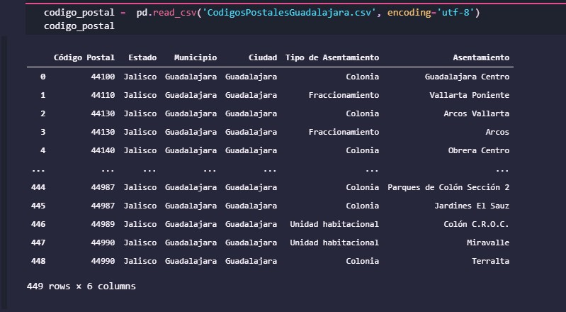
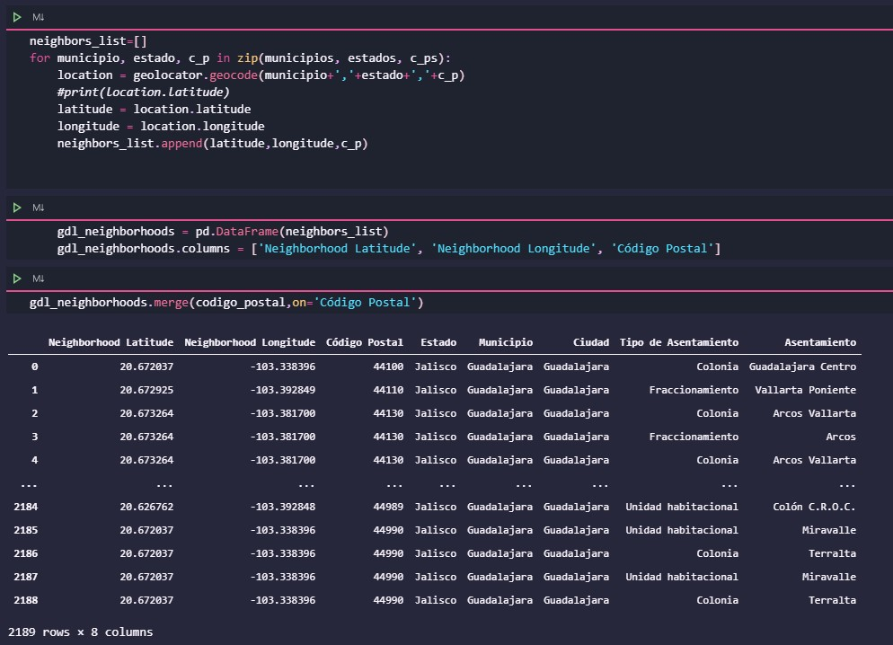

<h1>Looking for the best place for a bookstore cafeteria</h1>

<h2>Problem Definition</h2>

<h3>What</h3>
The business idea of ​​this project is to find the best place for a bookstore-cafeteria.

<h3>Whom</h3>
The analysis of this project is targeted to stakeholders who want to become partners in a bookstore-cafeteria in the Guadalajara City.

<h3>Why</h3>
The challenge is to find the right location for the cafeteria, taking into account that this service is aimed mainly at university students who are looking for a place to read or discuss ideas while having a good cup of coffee.

We need a neighborhood where there is at least one university, that is a consumer of cafeterias and that also has little competition from bookstores.

What will be generated are neighborhood clusters (with a university) with a higher probability of being successful based on the criteria in the previous paragraph, so that investors have the opportunity to decide the best location for the bookstore cafeteria.

<h2>Data Definition</h2>

This project requires the neighborhoods of the city of Guadalajara, these neighborhoods together with their zip code will be obtained from the page of the Mexican postal service: https://www.correosdemexico.gob.mx/SSLServicios/ConsultaCP/Descarga.aspx

 

Later it will be used <a href='https://nominatim.org/'>Nominatim</a> to geocode postal codes obtained from the postal service.

 

Once the georeferenced data of the neighborhoods is available, the application will be used <a href='https://es.foursquare.com/'> Foursquare </a> to find the ones with universities. A filter will be made to have only those neighborhoods with universities.

Finally, using <a href='https://en.foursquare.com/'> Foursquare </a> again, it will search for coffee shops and bookstores in these neighborhoods.

It will try to find a place where there is demand for coffee and low competition of bookstores

