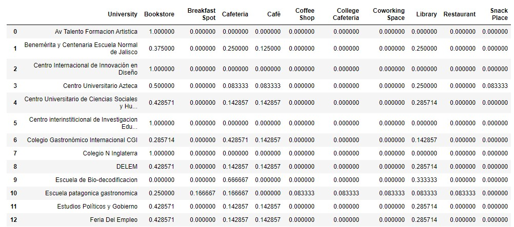
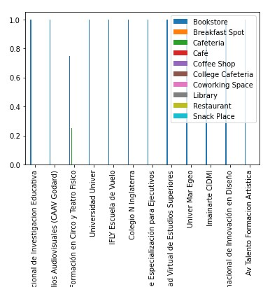

<h1>Looking for the best place for a bookstore-cafeteria</h1>

<h2>1. Introduction </h2>

Guadalajara is the second largest city in Mexico and it is gradually becoming a cosmopolitan city. It is an attractive area for young people living in western Mexico. Every year thousands of young people from regions close to Guadalajara come to study at the great variety of universities in the state, particularly in Guadalajara. And although the city is growing and they have the largest book fair in Latin America, it has 15 libraries for a million and a half inhabitants (approximately).

The business idea of ​​this project is to find the best place for a bookstore-cafeteria.

The analysis of this project is targeted to stakeholders who want to become partners in a bookstore-cafeteria in the Guadalajara City.

The challenge is to find the right location for the cafeteria, taking into account that this service is aimed mainly at university students who are looking for a place to read or discuss ideas while having a good cup of coffee.

We need a neighborhood where there is at least one university, that is a consumer of cafeterias and that also has little competition from bookstores.

What will be generated are neighborhood clusters (with a university) with a higher probability of being successful based on the criteria in the previous paragraph, so that investors have the opportunity to decide the best location for the bookstore cafeteria.

<h2>2. Data</h2>

This project requires the neighborhoods of the city of Guadalajara, these neighborhoods together with their zip code will be obtained from the page of the Mexican postal service: https://www.correosdemexico.gob.mx/SSLServicios/ConsultaCP/Descarga.aspx

 

Later it will be used <a href='https://nominatim.org/'>Nominatim</a> to geocode postal codes obtained from the postal service.

 

Once the georeferenced data of the neighborhoods is available, the application will be used <a href='https://es.foursquare.com/'> Foursquare </a> to find the ones with universities. A filter will be made to have only those neighborhoods with universities.

Finally, using <a href='https://en.foursquare.com/'> Foursquare </a> again, it will search for coffee shops and bookstores in these neighborhoods.

It will try to find a place where there is demand for coffee and low competition of bookstores.

<h2>3. Methodology</h2>

The first dataframe of this project is to establish the colonies with their latitude and longitude. Although the total is 449 colonies, the Nominatim API only found 266. As we have no other means to find the geocoding of the remaining 183, only 266 colonies will be taken into account.

 

Once the Guadalajara colonies are established, the Foursquare API will be used to find the universities. The universities will be the study regions. The universities found can be seen in the following map:

 

The point of study is to look for coffee shops and bookstores that are close to universities, so it is searched again with the Foursquare API for coffee shops and bookstores.

The graphs can be seen here: 

### Cafeterias

### Bookstores

### Libraries

Since we want to analyze the frequency of venues around the universities, they are grouped according to their average.

When you have the data from the universities with their respective libraries and cafeterias, they are integrated into a single dataframe and we note that there are 35 universities in Guadalajara:

What will be done later is to transform the data with one hot encoding and this will allow us to observe the frequency of each category by university.

Since you have this table, you can make a segmentation, but first you will use the elbow method to find the optimal number of clusters

It is established that the cluster number will be 4 and they look like this:

### Cluster 1

### Cluster 2

### Cluster 3

### Cluster 4

<h2>4. Results</h2>

The clusters are observed in the distribution of the Guadalajara map:

As we can see the cluster 1 has bookstores and some cafeterias, the cluster 2 has cafeterias but it hasn't bookstores. In cluster 3 we can find only bookstores, and finally in cluster 4 we can find a variety of bookstores and cafeterias.

It is observed that in cluster 3, the universities are outside the city center, while cluster 1 and 2 are grouped in the city center.

<h2>5. Discussion </h2>

In order to find the best place for a bookstore - cafeteria, it was established that it was where there was little competition in bookstores and several coffee consumers. In the clusters that were formed, it could be said that the best place is in cluster number 2.

However, in cluster 1, although there are bookstores, there are not too many and there are good coffee consumers. In short, cluster 3 and 4 are not among the candidates, since they have enough libraries.

Looking closely at cluster 1, there is only the same area, that is, the universities are close enough to have the same data. So, cluster 1 becomes a good candidate to establish a cafeteria bookstore because there are consumers of coffee and books.

On the other hand, in cluster 2, although there is no competition for bookstores, a more in-depth study would have to be done to affirm that there are consumers of books. We know that there are coffee consumers by the number of coffee shops. But, will it be profitable to put a bookstore where books are not consumed?

<h2>6. Conclusion </h2>

The objective of the project is to find the best place for a cafeteria bookstore and although it is a business that would be profitable, it is also a way to bring reading closer to young people, it is to give space for debate and the exchange of ideas in a place that I encouraged you to do so.

Many times in public libraries the staff does not let you speak and there are no spaces for this form of learning. Therefore, although in the data, the best option would be to have the establishment in cluster 1 because the sale of books and coffee is more likely. It is suggested that the establishment be close to the cluster 2 universities, since there are few spaces for reading, although there are enough coffee consumers.

