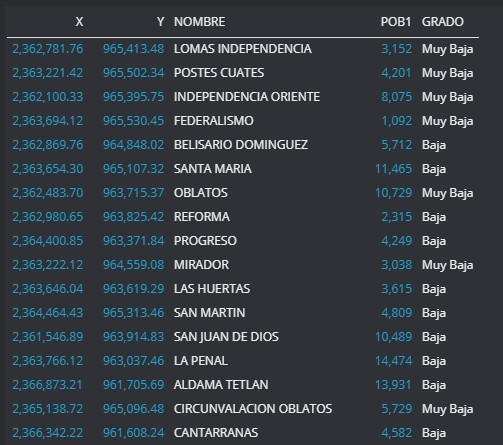

<h2> Data Description </h2>

https://datos.jalisco.gob.mx/dataset/grado-de-marginacion-por-colonia-y-sus-componentes-para-jalisco-2010

The data set that will be used in this project is public data from the state of Jalisco, these data show the degree of marginalization by neighborhood of the metropolitan area of ​​Guadalajara.

It contains the <i> colonies </i> with their respective <i> coordinates </i>, it also has the <i> size of the population of the colony </i>, and its <i> degree of marginalization </i>

  

To locate the marginalized areas where the construction of public spaces is most urgent, only those neighborhoods with a high and very high degree of marginalization will be taken into account.

Subsequently, with the help of Foursquare, the parks, squares, gardens or sports facilities that exist in these areas will be located to perform segmentation and clustering to make an analysis of the areas where more intervention is required.

